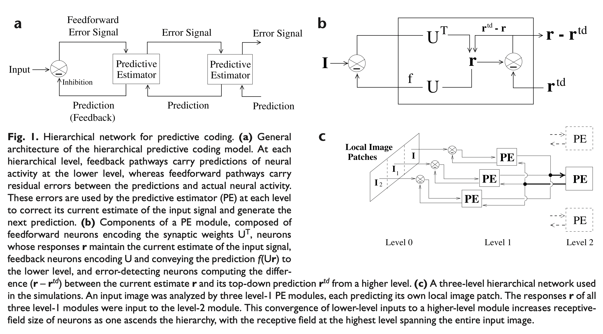

# RaoPredictiveCoding
Implementation of [Rao, Ballard: Predictive Coding in the Visual Cortex: a Functional Interpretation of Some Extra-classical Receptive-field Effects](https://www.researchgate.net/publication/13103385_Predictive_Coding_in_the_Visual_Cortex_a_Functional_Interpretation_of_Some_Extra-classical_Receptive-field_Effects).



## Framework for building Predictive Coding Networks

A Predictive Coding Network can be easily constructed by defining its architecture in a declarative way:
```python
from predictive_coding.pe_layer_config import PELayerConfig, PEParams
from predictive_coding.predictive_coding_network import PredictiveCodingNetwork


network = PredictiveCodingNetwork(
    input_size=25,
    layer_configs=[
        PELayerConfig(
            num_nodes=2,
            repr_size=10,
            params=PEParams(
                memory_loc=4,
                memory_scale=0.001,
                k1=0.0005,
                k2=0.005,
                sigma_sq=1.0,
                alpha=0.8,
                lambd=0.75,
            ),
        ),
        PELayerConfig(
            num_nodes=2,
            repr_size=5,
            params=PEParams(
                memory_loc=2,
                memory_scale=0.001,
                k1=0.001,
                k2=0.01,
                sigma_sq=2.0,
                alpha=1.0,
                lambd=1.0,
            ),
        ),
    ]
)
```

## Truly hierarchical network
Although the original paper provides no details on how to implement more than one higher-level PE modules, this work extends the original idea to hierarchical networks where each PE module can have multiple parents.
Currently, the predictions and errors of parents are averaged with equal, untrainable weights.
